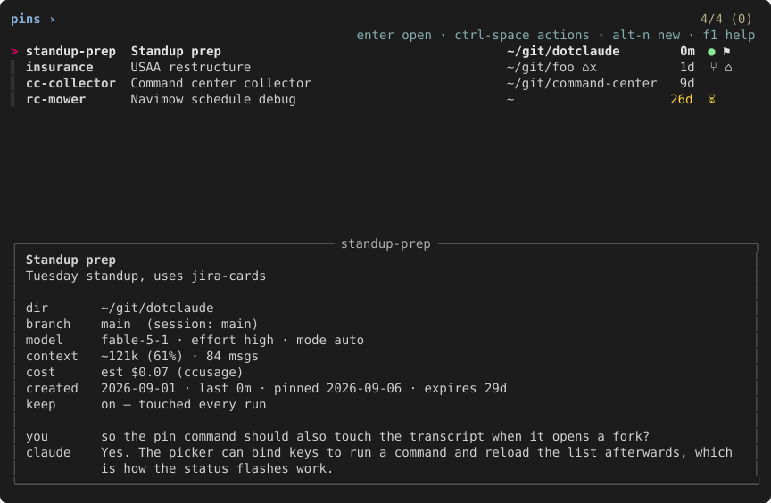

# claude-pins

Pin Claude Code sessions so you can find and resume them without remembering a UUID or the
directory they were launched from. A terminal command `pins` with an fzf picker, plus `/pins:pin`
and `/pins:unpin` slash commands shipped as a Claude Code plugin.



```
$ pins                # picker: enter opens, ctrl-x actions, ctrl-t pins a recent session, f1 help
$ pins standup        # one match → cd there and `claude --resume <id>`; several → picker pre-filtered
$ pins rc-mower --fork # one-off fork (new session id, original untouched)
$ pins add "rc mower" mower   # pin by title from the terminal; pins sessions lists what it matches
```

Inside Claude: `/pins:pin` pins the current session (Claude drafts an alias and title from the
conversation and confirms), `/pins:unpin` removes it. Claude Code namespaces plugin commands
with the plugin name, so that is how they appear in the command list. Everything else is
terminal-only.

A pinned session is also named after its pin inside Claude: its `/resume` picker, prompt box
and terminal title show `📌 rc-mower` for as long as the pin exists, and the name it had
before comes back when it is unpinned. A fork opened from a pin gets the plain alias as its
own name.

## Install

1. Add the marketplace and the plugin in Claude Code:

   ```
   /plugin marketplace add MasonFlint44/claude-toolbox
   /plugin install pins@claude-toolbox
   ```

2. Run `/pins:install` once. It symlinks `bin/pins` into `~/.local/bin`, installs bash or zsh
   completion for the shell you use, and runs `pins doctor`, which checks for **fzf ≥ 0.44**
   (optional: without it a built-in picker draws the same screens) and **ccusage** (optional;
   only for the cost line), and on a Mac says whether the terminal sends Option as Meta, which
   the alt keys need. `/pins:doctor` runs the same checks later and explains each line.

Python 3.10+ standard library only. Linux and macOS (WSL counts as Linux).

**Updating:** `/plugin update pins` (or auto-update for the marketplace in `/plugin`), then
`/pins:install` again, because the plugin directory moves on each version and the symlink
points into it, and restart Claude Code so its session-start hook runs from the new version. **Removing:** `/plugin uninstall pins`, delete `~/.local/bin/pins` and the
completion link; the store and cache below can go too.

### Plugin commands and skills

| | |
|---|---|
| `/pins:pin [alias [title…]]` | pin this session and name it `📌 alias`; with no arguments Claude drafts an alias and title from the conversation and confirms |
| `/pins:unpin` | unpin this session and put its previous name back; says so if it is not pinned |
| `/pins:install` | symlink, completion, `pins doctor` |
| `/pins:doctor` | run `pins doctor` and explain each line with a fix |
| session-start hook | touches the transcripts of pins with `keep` whenever Claude Code starts, resumes, clears or compacts; silent, comes with the plugin (`hooks/hooks.json`), listed by `/hooks` |

## How it works

- A pin stores an alias, title, session id, directory, note, and launch options. The store is
  `~/.local/state/claude-pins/pins.json` (`XDG_STATE_HOME` honored, `CLAUDE_PINS_FILE`
  overrides). Local per machine; atomic writes; a corrupt file is copied to `.bak` and never
  clobbered.
- Opening a pin runs `cd <dir> && claude --resume <id>` plus the pin's launch flags. Per-pin
  **fork** mode adds `--fork-session --name <alias>` (a fork inherits the session's name, so it
  gets the plain alias as its own); **worktree** mode adds `--worktree`. `--fork`, `-w [name]`
  and `--resume` are one-off overrides.
- Pinning names the session `📌 <alias>` the way `/rename` does, by appending Claude's own
  custom-title record to the transcript, so the pin shows in Claude's `/resume` picker, prompt
  box and terminal title. The picker shows it at once; a session that is running picks it up
  within a few turns. The pin's title stays the description you gave it (the session's title
  at pin time by default). Renaming the pin renames the session; unpinning puts back the name
  the session had before, or clears it if it had none; `pins undo` names it again. A name set
  inside the session with `/rename` after pinning is yours: `pins` leaves it alone from then on
  and says nothing about the name. Writing the name is activity, like opening: pinning
  restarts the transcript's retention clock and puts the session at the top of the recency
  sort, so a pin made on an old session is not swept days later. `pins sessions` and the
  new-pin screen list a pinned session under the pin's title, next to its 📌 alias tag.
- Claude Code deletes transcripts untouched for `cleanupPeriodDays` (default 30). A pin is only
  as durable as its transcript, so the picker shows ⏳ in the last 7 days (`CLAUDE_PINS_EXPIRE_WARN`)
  and 🔴 once the transcript is gone. Opening touches the transcript; pins with **keep** (🚩) are
  touched on every `pins` run and, by the plugin's session-start hook, every time Claude Code
  starts, so they hold as long as you use Claude at all. `pins prune` unpins the expired ones;
  `pins undo` restores the last unpin or prune.
- The cost line comes from [ccusage](https://github.com/ryoppippi/ccusage): offline first,
  and when its bundled price table has no price for a model the session used, one online run
  with a short timeout. If neither prices the model, the line says so and names the update
  command. Results are cached per transcript change.
- A session whose id appears in a running `claude` process is marked 🟢 and asks before
  resuming a second copy.
- If the pin's directory is gone: a Claude worktree (`<repo>/.claude/worktrees/<name>`) is
  recreated on its surviving `worktree-<name>` branch or fresh off HEAD, or you pick the repo
  root, `~`, another directory, or unpin. A branch mismatch is reported and checkout offered
  only when the tree is clean. Nothing switches branches on its own.

## Keys

| action | key | | action | key |
|---|---|---|---|---|
| open | enter | | new pin… | ctrl-t |
| open as fork | alt-o | | show expired | alt-a |
| open in new worktree | alt-w | | prune… | alt-p |
| actions palette | ctrl-x | | undo | alt-z |
| edit… | f2 | | cycle sort | alt-s |
| details | alt-i | | toggle preview | alt-v |
| touch transcript | alt-t | | help / shortcuts | f1 |
| toggle keep | alt-k | | refresh | ctrl-r |
| unpin | alt-x | | multi-select | tab |

Esc always goes back exactly one level. Toggle fork mode and toggle worktree mode have no
default key; both live in the palette. Every key is remappable from the f1 screen (enter rebinds,
ctrl-r resets a row, alt-r resets all) or by editing `~/.config/claude-pins/keys.toml`,
whose action names are `open`, `open_fork`, `open_worktree`, `palette`, `edit`, `details`,
`touch`, `keep`, `fork_mode`, `worktree_mode`, `unpin`, `new`, `expired`, `prune`, `undo`,
`sort`, `preview`, `refresh`, `help`, `select`. fzf's own query-editing keys and alt+enter (Windows
Terminal) are avoided on purpose. The palette, refresh, edit and new pin are on keys that reach
a program in every terminal, VS Code's included (ctrl-space and ctrl-alt-r never do there, and
VS Code keeps f1 for its own command palette: the help screen is in the actions palette).
Markers: 🟢 open · 🚩 keep · 🔀 fork · 🌳 worktree · ⏳ expiring ·
🔴 expired. On a terminal without emoji (a non-UTF-8 locale, the Linux console, `TERM=dumb`) they
become the one-cell ● ⚑ ⑂ ⌂ ⧗ ✗ in the same colours, the 📌 leaves the prompt and the
pinned tag's 📌 becomes ⚲;
`CLAUDE_PINS_GLYPHS=emoji` or `text` decides by hand.

The colours are Claude Code's own: the prompt in clay, the pointer and matched letters in
periwinkle, the effort and context values on the budget statusline's green-to-red ramp, the
permission mode in the colour Claude's mode indicator gives it. Everything else is dim, so the
look holds on light and dark terminals alike; `NO_COLOR` or `CLAUDE_PINS_COLOR=0` turns it all off.

Above the prompt sit the marker legend and the key hints, on one line when the terminal is
wide enough (about 150 columns) and stacked otherwise, then a status line that carries the
last action's result for one screen. Typing filters the list by alias, title and directory,
the way fzf matches; the `idle` column and the marker glyphs are shown but never matched.
`idle` is the time since the transcript was last written, which is what the retention clock
counts. The preview pane below the list
hides itself when it would get fewer than ten rows (the status line says `preview hidden:
terminal too short`); alt-i opens the same
details on a screen of their own, with more of the last exchange, and enter there opens the pin.
Directories shorten fish-style when the column is narrow (`~/g/c/claude-pins`), keeping the last
component; a Claude worktree shows as `~/git/repo › name`.

The list is read from the store every time a screen returns; ctrl-r re-reads it in place, for a
picker left open while another terminal pinned something. On fzf 0.46 and newer the rows also
re-fit themselves when the terminal is resized, and the header follows the width and the
height; 0.44 and 0.45 refit the rows at the next screen and the header on the next cursor
move or keystroke. On 0.63 and newer a blank row separates the prompt from the list; before
that fzf draws the column labels above the prompt. On 0.65.2 and newer the counter reads
`3 of 5 pins · 2 selected`.

ctrl-t lists the 200 most recent sessions under the same kind of column labels (title,
directory, idle, msgs) and filters them by title and directory; a session that is already
pinned ends its row with 📌 and the pin's alias, so enter there just says which pin it is.

In the editor the pane shows the pin as it would be saved, changed rows marked `*`. Enter
changes the highlighted field: booleans flip, choices open a short list with `(clear)`, and a
text field is typed on the query line under a `📌 pins › alias › edit › title ›` breadcrumb with
the current value already there (enter saves, esc cancels, ctrl-u clears). The directory field
lists completions of what is typed underneath; enter takes the highlighted one, or the text
when nothing matches. alt-s saves; esc goes back and offers save / discard / keep editing when
something changed. Every other question on the way (a new pin's alias, a key to rebind, prune,
a missing directory, a branch mismatch, a session already open) is a screen too: nothing
drops to a text prompt.

### Alt keys on macOS and in xterm

Every macOS terminal starts with the Option key typing symbols and accents, and stock xterm on
any system sends Meta as the character's high bit, so alt-i, alt-t and the other alt keys do
nothing until the terminal is told to send them as Esc+key. The picker names the switch on its
status line the first time it runs in such a terminal, keeps the line on the f1 screen until the
switch is on, and `pins doctor` reports it. The switches:

| terminal | setting |
|---|---|
| Terminal.app | Settings › Profiles › Keyboard › **Use Option as Meta key** |
| iTerm2 | Settings › Profiles › Keys › **Left Option key: Esc+** |
| VS Code | `"terminal.integrated.macOptionIsMeta": true` in settings.json |
| Ghostty | `macos-option-as-alt = true` in `~/.config/ghostty/config` |
| Kitty | `macos_option_as_alt yes` in `kitty.conf` |
| Alacritty | `[window]` `option_as_alt = "Both"` in `alacritty.toml` |
| WezTerm | on by default |
| xterm | `XTerm*metaSendsEscape: true` in `~/.Xresources`, then `xrdb -merge ~/.Xresources` |

The keys that need no switch (enter, tab, f1, f2, ctrl-x, ctrl-r, ctrl-t) cover the palette,
and the palette lists every action.

### Without fzf

When fzf is missing or older than 0.44 (or with `--no-fzf`), `pins` draws the same screens itself:
the same header, prompt and counter, the same pointer, marker and current-row highlight, the
preview pane and its size rule, the palette, the editor, the details and help screens and every
prompt, with the same keys, including the keymap file; a resize re-lays the rows out and the
header follows the width and the height. Typing filters with fzf's syntax: space
separates terms that must all match, `'exact`, `^prefix`, `suffix$`, `!not`, `a | b`, and a term
with a capital letter is case-sensitive. The mouse works: a click moves the cursor, a
double-click opens, a right click toggles a selection, the wheel moves through the list or
scrolls the pane (shift-up / shift-down scroll it from the keyboard); select text with
shift-drag while the picker is up. Rows keep their order under both pickers (fzf runs with
`--no-sort`, so the sort you chose holds while you type). `pins doctor` says whether fzf was
found and how to install it. `pins _keys` names every key and mouse event as the picker reads
it, for checking a terminal. A question asked where there is no terminal (a pipe, a script) is
cancelled.

## Command line

`pins --help` and `pins <subcommand> --help` print the same information.

```
pins [words…] [--fork | --resume | -w [name]] [--sort recency|alias|pinned] [--all] [--no-fzf]
```

| | |
|---|---|
| `pins` | the picker; enter opens, esc leaves |
| `pins <words…>` | loose match over alias and title, every word must appear; exactly one hit opens it, several open the picker pre-filtered, none prints "no pin matches" |
| `--fork` / `--resume` / `-w [name]` | one-off open mode: fork the session, plain resume ignoring the pin's modes, or a new worktree (optionally named); these apply to a unique match |
| `--sort`, `--all`, `--no-fzf` | starting sort, show expired pins from the start, use the built-in picker even though fzf is there |

Every subcommand exits 0 on success and 1 with a one-line message on `stderr` otherwise.

| Subcommand | What it does |
|---|---|
| `pins add <session> <alias> [--title …] [--note …] [--cwd …] [--keep] [--fork] [--worktree] [--rename]` | pin a session. `<session>` is a session id, a unique id prefix (8+ characters), or words that must all appear in the title or directory of one of the 200 most recent sessions (quote them: `pins add "rc mower" mower`); several matches are listed with their ids. Title and directory default to the transcript's; a session given by full id with no transcript yet is accepted with a warning. Names the session `📌 alias` and says so. Pinning an already pinned session says "already pinned as X" and, with `--title`/`--note`, updates it, or with `--rename`, renames it (and the session); a taken alias is refused with a suggested `alias-2` |
| `pins list [--all] [--sort …] [--json]` | the rows the picker shows, expired ones hidden unless `--all`; on a terminal they get the column labels and the marker legend, piped output is bare rows; `--json` adds `state`, `age`, `open`, `markers`, `remaining_days` per pin |
| `pins sessions [words…] [--json]` | the 200 most recent sessions, newest first, with their short ids, titles, directories, idle times, message counts and, for a pinned one, the pin's title in place of the session's name plus 📌 and the pin's alias; column labels on a terminal. The listed id is the shortest prefix (8 characters, more when two sessions share them) that `pins add` resolves. Words filter the way `pins add` matches. This is what to run when you want to pin something by title from the terminal |
| `pins edit <alias> [flags]` | set fields directly: `--title`, `--note`, `--cwd`, `--rename <alias>`, `--model`, `--effort`, `--permission-mode` (empty string clears), `--keep`/`--no-keep`, `--fork`/`--no-fork`, `--worktree`/`--no-worktree`. With no flags, the interactive editor |
| `pins rename <alias> <new-alias>` | rename a pin and its session's name; a taken alias is refused with a suggestion (`pins edit --rename` does the same) |
| `pins open <alias> [--fork] [--resume] [-w [name]]` | open by exact alias, with the same one-off modes as above; runs the already-open, missing-directory and branch prompts first |
| `pins rm <alias>` / `pins unpin <alias>` | unpin, no confirmation, and put the session's previous name back (or clear it), saying which; "no pin named x" when there is none |
| `pins undo` | restore the last unpin or prune (the last ten are kept) and name the session after the pin again; a restored alias that is taken meanwhile comes back as `alias-2` |
| `pins prune [-y]` | unpin every expired pin after listing them and asking; `-y` skips the question; "nothing to prune" otherwise |
| `pins touch <alias>` | bump the transcript's mtime, restarting its retention clock |
| `pins doctor` | fzf version (optional: `·` with the install command when it is missing or old), on a Mac whether the terminal sends Option as Meta, ccusage and its price coverage across your sessions, store health, how many pins have `keep` and whether the plugin's session-start hook runs to touch them (`·` when the plugin is not enabled), projects directory, cleanup period, keymap file; exit 1 if anything is ✗ |

Every run of any of these also touches the transcripts of pins with `keep`, as does the
plugin's session-start hook (`pins _keep`, which prints nothing).

## Files and environment

| | |
|---|---|
| `~/.local/state/claude-pins/pins.json` | the store (`XDG_STATE_HOME`; `CLAUDE_PINS_FILE` overrides) |
| `~/.config/claude-pins/keys.toml` | keymap, written by the f1 screen; one `action = "key"` line per action, an empty string unbinds (`XDG_CONFIG_HOME`; `CLAUDE_PINS_KEYMAP` overrides) |
| `~/.cache/claude-pins/` | transcript summaries and cost answers, keyed on the transcript's mtime; safe to delete (`XDG_CACHE_HOME`) |
| `CLAUDE_CONFIG_DIR` | where Claude's `projects/` and `settings.json` live (default `~/.claude`) |
| `CLAUDE_PINS_SORT` | starting sort: `recency` (default), `alias`, `pinned` |
| `CLAUDE_PINS_EXPIRE_WARN` | days before expiry at which ⏳ shows (default 7) |
| `CLAUDE_PINS_NO_FZF` | use the built-in picker even though fzf is there |
| `CLAUDE_PINS_GLYPHS` | `emoji` or `text` markers (default: emoji on a UTF-8 locale outside the Linux console) |
| `NO_COLOR` / `CLAUDE_PINS_COLOR=0` / `CLAUDE_PINS_COLOR=1` | never / never / always color |
| `CLAUDE_PINS_FZF`, `CLAUDE_PINS_CCUSAGE` | alternate binaries |
| `CLAUDE_PINS_PS`, `CLAUDE_PINS_NOW`, `CLAUDE_PINS_TUI_SCRIPT`, `CLAUDE_PINS_TUI_LOG`, `CLAUDE_PINS_OS` | test hooks: a fake process table file, a fake clock (epoch seconds), a scripted terminal for the built-in picker and its log, a fake platform (`darwin`, `linux`) for the Option-as-Meta check |

## Development

```
python3 -m unittest            # store, reader, expiry, git worktrees, opener prompts, picker flows, both pickers
bash tests/coverage.sh         # the same suite under coverage, bin/pins subprocesses included (needs uv)
bash tests/completion_check.sh # bash completion (CI also runs it on bash 3.2 / 4.4 / 5.2 images, plus shellcheck)
zsh tests/zsh_completion_check.sh                 # zsh completion
python3 -m unittest -v tests.test_fzf_real        # every screen's rows through the real fzf on PATH (CI: 0.44.1 to 0.74.3)
uv run docs/preview.py                            # regenerate the README preview
```

The tool itself is stdlib only. `pyproject.toml` exists for the dev tools (`coverage`, `pyte`),
which `uv sync --group dev` installs into `.venv`; `uv run` finds them without activating it.

Tests never run the real `claude`: a stub on `PATH` records the argv and cwd it was launched
with. Zero Claude usage in CI. A scripted stand-in for fzf drives the picker's flows, a scripted
terminal drives the built-in picker's, and `tests/test_fzf_real.py` feeds what every screen sends
to a real fzf to check that queries match, that the built-in matcher keeps the same rows, and
(with `pyte`) that the two backends draw the same cells; CI runs that against four fzf versions,
and locally it uses whichever fzf is on `PATH`. `tests/test_tui_pty.py` runs the built-in picker
in a pseudo-terminal for what only a terminal shows.
`tests/test_plugin.py` checks the plugin files without a model: frontmatter, the commands'
dynamic-context snippets against a real store, the install skill's shell steps in a sandbox,
and that every line the doctor skill explains is one `pins doctor` prints.

```
tests/skills/run.sh [-m MODEL] [-n RUNS] [CASE...]   # headless skill runs through `claude -p`; paid, by hand
```

Each case under `tests/skills/cases/` is a prompt plus setup and check scripts, run with the
plugin loaded against a throwaway HOME whose `claude` on PATH is a stub, so no case can start
a real session. Seven cases (pin with and without arguments, already pinned, unpin, unpin
when nothing is pinned, install, doctor) cost about $0.50 on sonnet.

Whether the skills *trigger* on the right requests is a separate question, checked with the
[skill-creator](https://github.com/anthropics/claude-plugins-official) plugin's description
evaluator over twenty queries per skill in `tests/skills/triggers/` (ten that should trigger,
ten near-misses that should not):

```
tests/skills/triggers.sh -e [-m MODEL] [-r RUNS] [SKILL...]   # score the current descriptions
tests/skills/triggers.sh [-m MODEL] [SKILL...]                # optimizer: proposes a better description
```

The optimizer never edits `SKILL.md`; it prints the best description it found, scored on a
held-out split, for you to paste in. `-e -m haiku -r 1` is a two-minute smoke test per skill.

Whether real terminals deliver the keys is checked in Docker:

```
tests/terminals/run.sh [TERMINAL...]   # xterm, GNOME Terminal, Konsole, Kitty, Alacritty, Ghostty, tmux; by hand
```

It builds an image with those terminals under Xvfb (about 4 GB, once), runs `pins _keys` in
each while xdotool presses every key the picker binds, the query-editing keys and the mouse,
takes a screenshot of the picker, and writes a table of what each terminal delivered to
`tests/terminals/out/report.md`. Keys a terminal keeps for itself show up there as missing
(GNOME Terminal's F10 and F11, Konsole's F11, tmux's ctrl-b prefix); stock xterm needs
`XTerm*metaSendsEscape: true` before alt keys arrive at all.

**Releasing:** add a `CHANGELOG.md` section, bump `version` in `.claude-plugin/plugin.json`
and `claude_pins/__init__.py` (a test keeps the three in step), commit `Version X.Y.Z`, tag
`vX.Y.Z` with the section as its message, `gh release create` with the same notes. The
marketplace needs no change: its entries carry no version.

MIT — see `LICENSE`. Version history in `CHANGELOG.md`.
